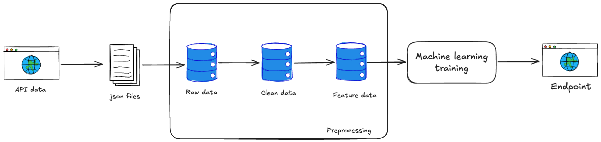

# Introduction

This is a full data project where I use data from an API to train model that predicts if a flight will be delayed or not. For this, I want:

1. Ingest data from [AviationStack](https://aviationstack.com/) with data from flights all around the world.
2. Load the raw ingested data into a database.
3. Clean and transform the data.
4. Train a machine learning model to predict if a flight will be delayed or not (binary classification).
5. Serve this model in an endpoint.
6. Automate the ingestion, processing, model training.

A rough representation of what I want is shown in this scheme here:
